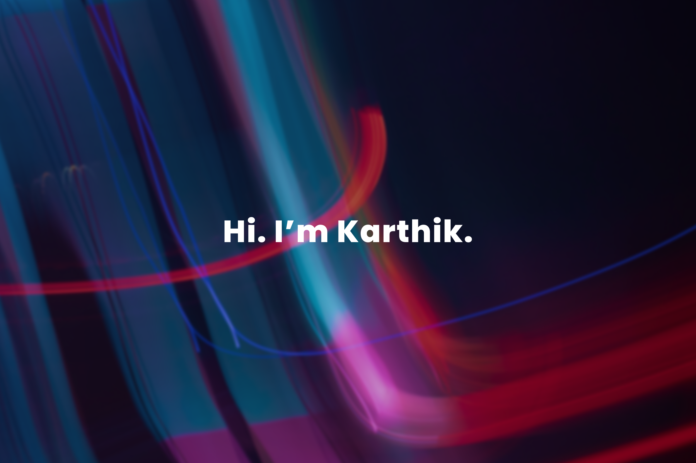

<!--
**MasaLion/masalion** is a ✨ _special_ ✨ repository because its `README.md` (this file) appears on your GitHub profile.

Here are some ideas to get you started:
-->

- 🔭 I’m currently working on personal projects (Details Soon 🐱‍👤)
- 🌱 I’m currently learning React Native 
- 👯 I’m looking to collaborate on interesting projects with motivated people
- 💬 Ask me about Full-Stack Development, Systems Administration (Windows/Linux), Networking
- 📫 How to reach me: You can find me on [![Twitter][1.2]][1], or on [![LinkedIn][3.2]][3].
- 😄 Pronouns: He/Him
- ⚡ Fun fact: ...

<!-- Icons -->

[1.2]: http://i.imgur.com/wWzX9uB.png (twitter icon without padding)
[2.2]: https://raw.githubusercontent.com/MartinHeinz/MartinHeinz/master/linkedin-3-16.png (LinkedIn icon without padding)

<!-- Links to your social media accounts -->

[1]: https://twitter.com/Martin_Heinz_
[2]: https://www.linkedin.com/in/heinz-martin/